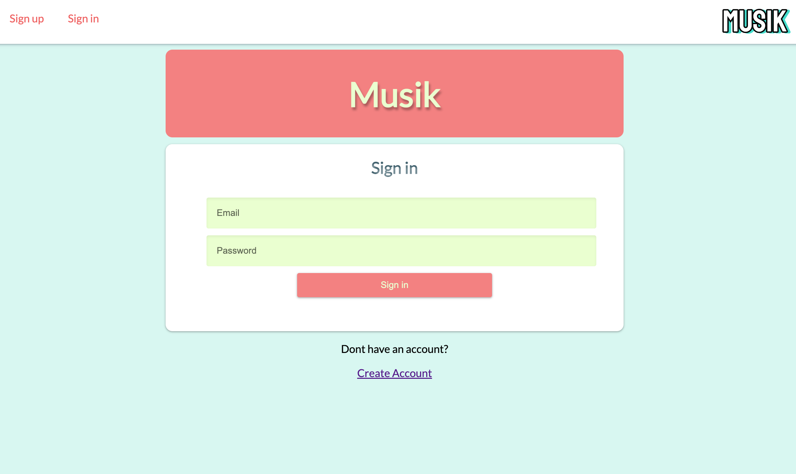
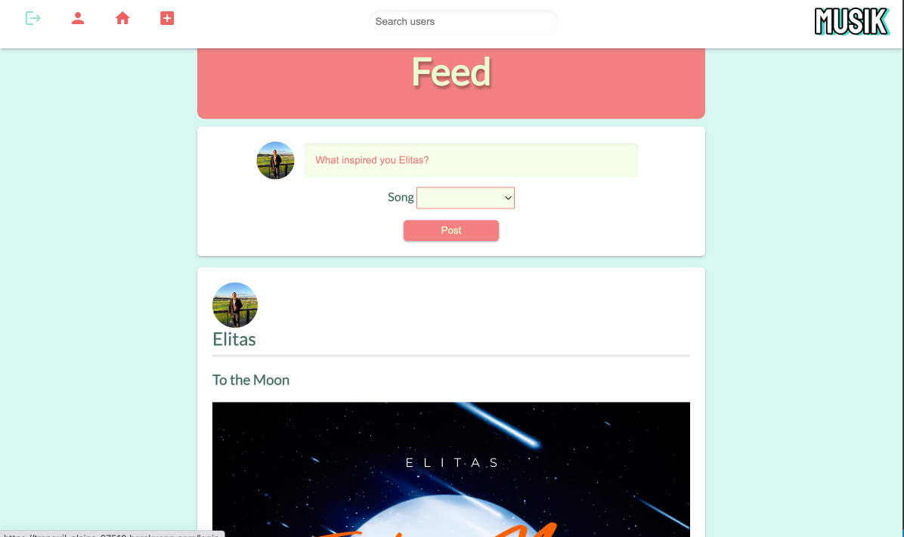
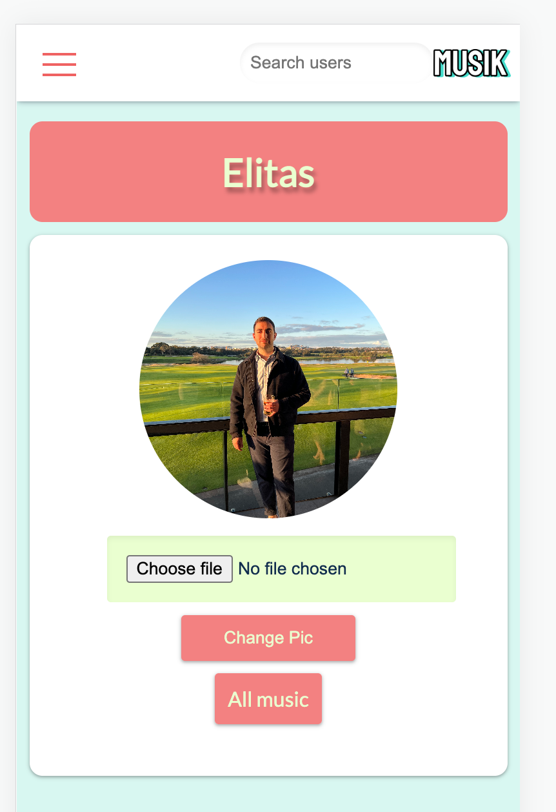

<h1 style="text-align: center; line-height:  80px;">Musik app</h1>

<h2 style="text-align: center;">Welcome to Elias Khoury's Musik app</h2>

<h3 style="text-align: center; line-height: 50px;">This a mobile friendly social media application that enables users to post their songs on to thier profile and a communal feed for all other users to view.  </h3>

Accessible online at [https://tranquil-plains-67510.herokuapp.com/](https://tranquil-plains-67510.herokuapp.com/)

------
-----
 

## **Table of Contents**

- [Design](#design)
- [Built With](#built-with)
- [Functionality](#functionality)
- [Creator](#creator)
- [Acknowledgments](#acknowledgments)  
  
------
------
   

## Design
 

### Fonts

[Lato](https://fonts.googleapis.com/css2?family=Lato&family=Press+Start+2P&display=swap) - A more modern font that is targeted towards a social media audience.   

 

### Main Color Scheme

 

### Other design factors
- It has been optimised using media query for mobile use.
- Simplistic design with google material icons.
- Icons are replaced with a hamburger menu during reduced width view to avoid overlap. 

-------
------

 

## Built With
- [Ruby on Rails(5.2)](https://rubyonrails.org/)
- [HTML5](https://www.w3schools.com/html/)
- [CSS3](https://www.w3schools.com/css/)
- [JavaScript](https://www.w3schools.com/js/DEFAULT.asp) with [JQuery](https://jquery.com/).
- File upload and database done with [Cloudinary](https://cloudinary.com/)
- Hosted on [Heroku](https://www.heroku.com/)

 

---
______

## Functionality
- User login that is encrypted with [bcrypt](https://www.npmjs.com/package/bcrypt).
- The ability to add and update photos using the Cloudinary gem and database.
- Embedded soundcloud player for assignment of user songs.
- A feed page that displays all users posts chronologically. 
- A profile page that allows users to upload their song details and soundcloud data.
- A search function that enables users to search for other users.

 

---
______

 

## Creator

- **Elias Khoury** - a student of General Assembly.

 

-----
----

 

## Acknowledgments 
- General Assembly teachers (*Joel & Loden*) and other student feedback. 
- HUGE shout out to Loden for making it his personal mission to assist everyone during the process including staying back way past his required hours. 
- Coffee
- Youtube
- Dual monitors
- 